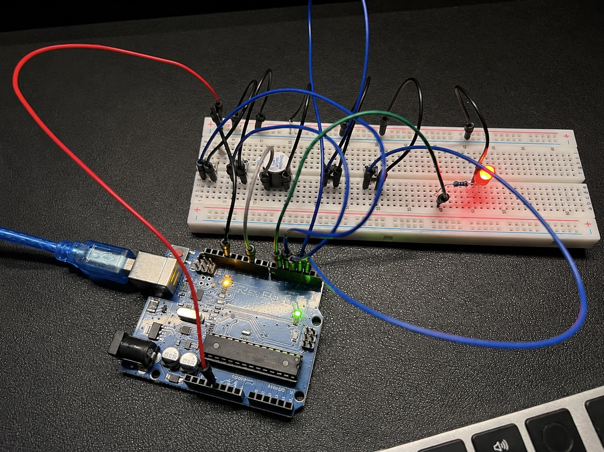

# Embedded Event Simulator & Fault Monitor



[](https://github.com/JWiggins973/embedded-event-simulator/actions/workflows/python-app.yml)

Embedded system that simulates industrial hazard events using physical buttons, logs them to a SQLite database over serial, and exposes a CLI for querying event history. Includes LED and buzzer alerts for critical failures.

## ⚙️ How It Works

- Press a button to trigger a hazard event. Arduino sends it over serial to Python.
- Python validates, assigns severity, and logs it to SQLite with a timestamp.
- All 4 buttons pressed simultaneously triggers the buzzer and flashing LED until cleared.

[View Architecture Diagram](docs/cameo-model/architecture-overview.jpg)

## 💻 Run Locally

**1. Clone and set up the environment:**

```bash
git clone https://github.com/JWiggins973/embedded-event-simulator.git
cd embedded-event-simulator
python3 -m venv venv
source venv/bin/activate
pip install -r requirements.txt
```

**2. Flash and configure:**

1. Flash `arduino/event-sim/event-sim.ino` to the Arduino with the Arduino IDE.
2. Find your serial port: `pyserial-ports` (installed with pyserial).
3. Set `PORT` in `backend/serial_listener.py` to that port.

**3. Run:**

```bash
chmod +x run.sh
./run.sh
```

## ⌨️ CLI Commands

```bash
python backend/cli.py events            # All logged events
python backend/cli.py summary           # Event counts by type
python backend/cli.py search TEMP_HIGH  # Search by event type
python backend/cli.py system-failure    # System failure events only
```

Duration shows `None` in V1. Event duration tracking coming in V2.

## 🛠 Stack

- **Firmware:** Arduino UNO, C++ / ESP32-S3, FreeRTOS
- **Serial Processing:** Python, pyserial
- **Database:** SQLite
- **CLI:** Click
- **Testing:** Pytest, unittest.mock
- **CI/CD:** GitHub Actions

## 📁 Project Structure

```
embedded-event-simulator/
├── .github/workflows/tests.yml
├── arduino/
│   ├── event-sim/event-sim.ino
│   └── event-sim-esp32.ino
├── backend/
│   ├── database.py
│   ├── serial_listener.py
│   └── cli.py
├── test/
│   ├── test_database.py
│   ├── test_serial.py
│   └── test_cli.py
├── docs/
│   ├── cameo-model/
│   │   ├── architecture-overview.jpg
│   │   └── event-sim.sysml
│   └── test_plan.md
├── wokwi/
│   └── diagram.json
├── images/
├── requirements.txt
├── run.sh
└── README.md
```

## 🧪 Testing

30 tests covering core functionality and edge cases including mocked hardware interfaces. Runs without Arduino connected.

```bash
pytest test/ -v
```

| File | Tests | What's Covered |
|---|---|---|
| test_database.py | 10 | Insert, query, filter, counting, edge cases |
| test_serial.py | 7 | Validation, mocked serial, severity mapping |
| test_cli.py | 13 | All commands, formatting, empty states, edge cases |

## 📍 Coming Soon

ESP32-S3 with WiFi support — replacing USB serial transport with HTTP POST to a FastAPI endpoint.

## 🔗 Hardware References

- [Wokwi Schematic](wokwi/diagram.json)
- [TinkerCAD Schematic](https://www.tinkercad.com/things/cTCtQ8Y2Rf1-embedded-event-simulator)
- [RexQualis Arduino UNO R3 Kit](https://www.amazon.com/REXQualis-Development-Membrane-Receiver-Detailed/dp/B074WMHLQ4)

## 👤 Author

Jermaine Wiggins
