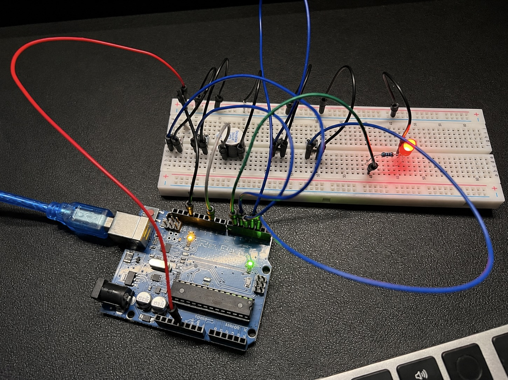

# Embedded Event Simulator & Fault Monitor



[](https://github.com/JWiggins973/embedded-event-simulator/actions/workflows/python-app.yml)

Embedded system that simulates industrial hazard events using physical buttons, logs them to a SQLite database over serial, and exposes a CLI for querying event history. Includes LED and buzzer alerts for critical failures.

## ⚙️ How It Works

- Press a button to trigger a hazard event. Arduino sends it over serial to Python.
- Python validates, assigns severity, and logs it to SQLite with a timestamp.
- All 4 buttons pressed simultaneously triggers the buzzer and flashing LED until cleared.

[View Architecture Diagram](docs/cameo-model/architecture-overview.jpg)

## 💻 Run Locally

**1. Clone and set up the environment:**

```bash
git clone https://github.com/JWiggins973/embedded-event-simulator.git
cd embedded-event-simulator
python3 -m venv venv
source venv/bin/activate
pip install -r requirements.txt
```

**2. Flash and configure:**

1. Flash one sketch to your board with the Arduino IDE:
   - Arduino UNO R3: `arduino/event-sim/event-sim.ino`
   - ESP32-S3: `arduino/wokwi-esp32/event-sim-esp32.ino`
2. Find your serial port: `pyserial-ports` (installed with pyserial).
3. Set `PORT` in `backend/serial_listener.py` to that port.

**3. Run:**

```bash
chmod +x run.sh
./run.sh
```

## ⌨️ CLI Commands

```bash
python backend/cli.py events            # All logged events
python backend/cli.py summary           # Event counts by type
python backend/cli.py search TEMP_HIGH  # Search by event type
python backend/cli.py system-failure    # System failure events only
```

Duration shows `None` in V1. Event duration tracking coming in V2.

## 🛠 Stack

- **Firmware:** Arduino UNO, C++ / ESP32-S3, FreeRTOS
- **Serial Processing:** Python, pyserial
- **Database:** SQLite
- **CLI:** Click
- **Testing:** Pytest, unittest.mock
- **CI/CD:** GitHub Actions

## 📍 Coming Soon

WiFi support on the ESP32-S3 — replacing serial.py with FastAPI for HTTP POST.

## 🧪 Testing

30 tests covering core functionality and edge cases. Runs without Arduino connected.

```bash
pytest -v 
```
or
```bash

pytest
```

See the [test plan](docs/test_plan.md) for coverage details and scenarios.

## 🔗 Hardware References

- [Wokwi Schematic](arduino/wokwi-esp32/diagram.json)
- [TinkerCAD Schematic](https://www.tinkercad.com/things/cTCtQ8Y2Rf1-embedded-event-simulator)
- [RexQualis Arduino UNO R3 Kit](https://www.amazon.com/REXQualis-Development-Membrane-Receiver-Detailed/dp/B074WMHLQ4)

## 👤 Author

Jermaine Wiggins
